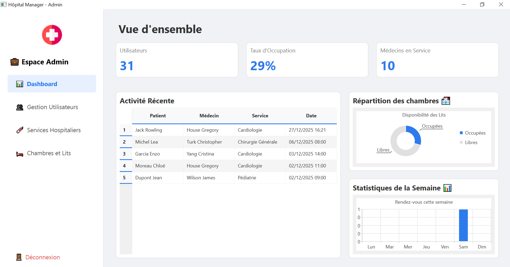
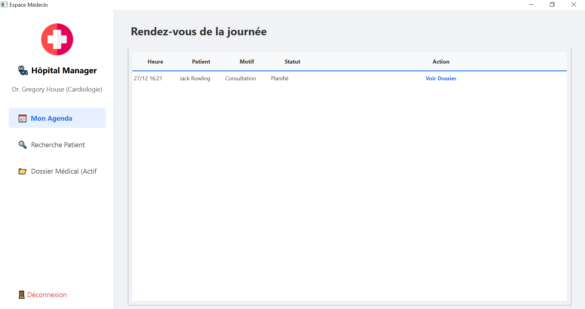
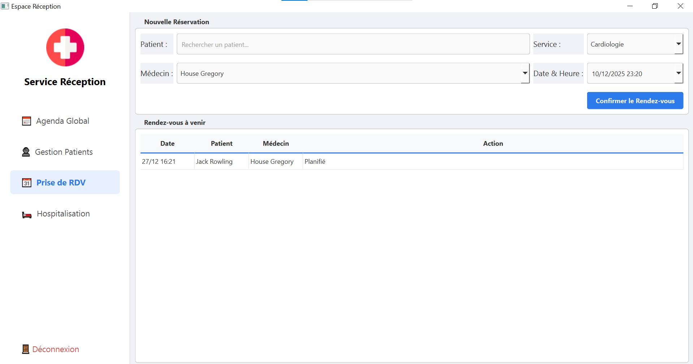
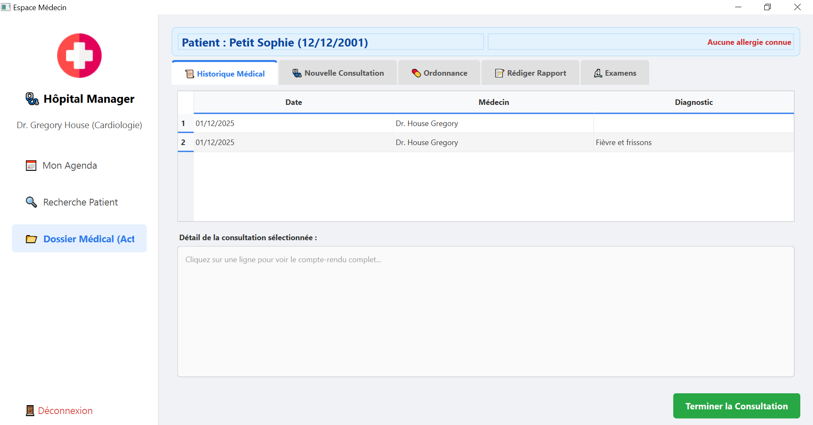

# 🏥 Hospital Management System (Hôpital Manager)


## 📝 Description

**Hôpital Manager** est une application de bureau complète conçue pour digitaliser et optimiser la gestion administrative et médicale d'un établissement hospitalier. 

Développée en **C++** avec le framework **Qt**, elle offre une interface graphique moderne et réactive, connectée à une base de données **PostgreSQL** pour garantir la sécurité et la centralisation des données. L'application gère les flux de travail de quatre acteurs principaux : Administrateurs, Médecins, Réceptionnistes et Patients.

## ✨ Fonctionnalités Principales

### 👨‍💼 Espace Administrateur
- **Tableau de Bord (Dashboard) :** Visualisation des KPI en temps réel (taux d'occupation, statistiques des consultations).
- **Gestion des Utilisateurs :** Création et gestion des comptes (Médecins, Réceptionnistes) avec gestion des rôles (RBAC).
- **Gestion de l'Infrastructure :** Configuration des services hospitaliers, gestion des chambres et des lits.

### 👩‍⚕️ Espace Médecin
- **Agenda Médical :** Vue des consultations planifiées.
- **Dossier Médical Électronique (DME) :** Accès à l'historique patient, ajout de diagnostics et comptes-rendus.
- **Prescriptions :** Génération et impression d'ordonnances.
- **Recherche Patient :** Accès rapide aux dossiers via un moteur de recherche.

### 🛎️ Espace Réception
- **Gestion des Patients :** Enregistrement des nouveaux patients et mise à jour des dossiers administratifs.
- **Prise de Rendez-vous :** Planification des consultations avec vérification des disponibilités.
- **Hospitalisation :** Gestion des admissions et affectation des lits/chambres.

### 👤 Portail Patient
- **Consultation :** Accès à l'historique des rendez-vous et des prescriptions.
- **Tableau de bord personnel :** Notifications et prochains rendez-vous.

## 📸 Aperçu de l'Application

*(Ajoutez ici vos captures d'écran dans le dossier `screenshots` et décommentez les lignes)*

| Dashboard Admin | Agenda Médecin |
|:---:|:---:|
|  |  |

| Prise de RDV (Réception) | Dossier Médical |
|:---:|:---:|
|  |  |

## 🛠️ Stack Technique

* **Langage :** C++17
* **Interface Graphique :** Qt Framework 6.x (Widgets, Charts, PrintSupport)
* **Base de Données :** PostgreSQL
* **Système de Build :** CMake 3.16+
* **Accès aux données :** Module Qt SQL (QSqlDatabase)

## 📂 Structure du Projet

Le projet suit une architecture modulaire pour faciliter la maintenance :

```text
src/
├── admin/       # Logique et interfaces de l'administrateur
├── doctor/      # Logique et interfaces du médecin
├── reception/   # Logique et interfaces de la réception
├── patient/     # Logique et interfaces du patient
├── auth/        # Gestion de la connexion (LoginWindow)
├── db/          # Connexion et gestion de la base de données
└── resources/   # Images, icônes et fichiers de style (.qrc)
